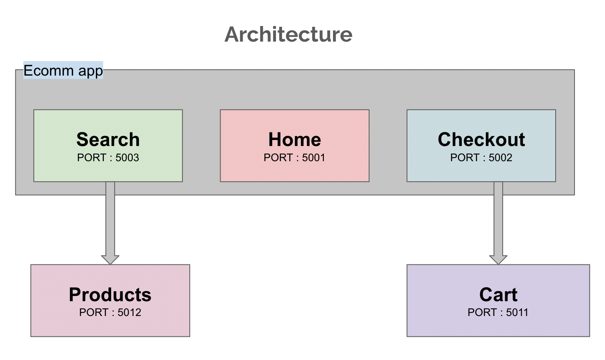

# Module Federation Demo

1. React Demo
```console
cd react-module-federation
yarn
yarn start
```
2. React TS Demo
```console
cd ts-react-module-federation
yarn
yarn start
```
3. Angular Demo
```console
cd ng-module-federation/remote
yarn
yarn start

cd ng-module-federation/remote2
yarn
yarn start

cd ng-module-federation/host1
yarn
yarn start
```
4. MFE Demo
```console
cd ecomm-demo
yarn
yarn start
```

Start Docker
```console
yarn mfdashboard
```


